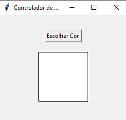

# Relatório: Simulador de Lâmpada Inteligente RGB

## Introdução

 Esse documento tem objetivo em relatar o processo de escolha, implementação e resultados do projeto de um simulador de troca de cores para uma lâmpada inteligente RGB utilizando arquivos Python e um Servidor Broker MQTT, para composição da N4 da matéria de Sistemas Distribuídos com Internet das Coisas, do Professor Thiago de Jesus Inocêncio.

---

## Descrição da Solução

### Introdução

Recebermos a proposta de projeto necessário que deveria conter os seguintes tópicos:

#### 1. Publicador (Publisher)
O Publicador poderia ser hardwares como ESP32 ou Raspberry Pi ou Aplicações em Python/Java para envio de mensagens ou comandos.

#### 2. Assinante (Subscriber)
O Assinante poderia ser um dispositivo ou aplicação que se inscreva no tópico para receber mensagens ou comandos.


#### 3. Broker MQTT
No Broker, era necessário escolhar e configurar um broker MQTT pelo Mosquitto, hospeado em uma instância EC2 na AWS ou solução gratuitas como o Blink ou Brokers online.

---
### Decisões do Grupo

Com os requisitos solicitados e tecnologias disponíveis entre nós, decidimos por fazer uma simulação de casa inteligente com a mudança de cores de uma lâmpada RGB inteligente.

Decidimos optar por esse cenário por interesse maior do grupo em automação de casa com dispotivos IoT e planejamos possível continuação após a entrega da atividade.

As escolhas feitas pela equipe seriam:

- Utilizar uma aplicação Python como **PUBLISHER**, com o objetivo de fazer o envio das cores para o Broker MQTT;

- Também, utilizamos outra aplicação Python como **SUBSCRIBER** com o objetivo de simular a lâmpada RGB inteligente e receber a cor enviada pelo Publisher;

- E como **BROKER MQTT**, optamos por utilizar o Mosquitto hospeado na AWS EC2 apresentado nas aulas.

--- 

## Implementação Técnica

### Broker MQTT

#### 1. Criação da Instância EC2
- Inicialmente, é necessário criar uma instância EC2 na AWS. Optamos por utilizar a versão gratuita do mesmo, já que um Servidor Broker MQTT não precisa de grande processamento e pouca banda para ser utilizado para essa simulação. Clique para "Executar instância";


- Insira um nome para Instância;


- Selecione a imagem de Sistema Operacional Ubuntu para esse Broker


- Aqui, usaremos o tipo t2-micro, por ser qualificado como gratuito no site da AWS


- Agora, é necessário criar uma par de chaves para a segurança do nosso broker, segue as opções a serem escohlidas:


- Agora as opçõpes de rede são as seguintes:

<br>


- Após isso, basta executar a instância e partir para as configurações do sistema operacional do broker.

#### 2. Comandos bash para configuração
Depois de configurar o broker e se conectar a instância, irá ser direcionado ao console bash do EC2 criado.


E agora, será necessárrio usar os seguintes comandos:

```bash
sudo apt update
sudo apt install mosquitto mosquitto-clients


sudo systemctl enable mosquitto
sudo systemctl start mosquitto
sudo systemctl status mosquitto
``` 

Os comandos fazem com o que atualize a lista de pacotes disponíveis e suas versões, instala a biblioteca do broker o **MOSQUITTO**, disponibliza, inicia e mostra o status do mesmo para checar se está tudo rodando corretamente.

Com isso, o Broker MQTT está devidamente configurado e pronto para uso.

### Script publisher.py

Aqui está o código dividido em partes com explicações detalhadas:

---

#### **1. Importação de Bibliotecas**

```python
import tkinter as tk
from tkinter import colorchooser
import paho.mqtt.client as mqtt
from dotenv import load_dotenv
import os
```

- **`tkinter`**: Biblioteca padrão do Python para criar interfaces gráficas.
- **`colorchooser`**: Módulo do `tkinter` que fornece um seletor de cores.
- **`paho.mqtt.client`**: Biblioteca para interagir com um broker MQTT.
- **`dotenv`**: Biblioteca para carregar variáveis de ambiente de um arquivo `.env`.
- **`os`**: Usada para acessar variáveis do sistema e manipular arquivos.

---

#### **2. Carregamento das Variáveis de Ambiente**

```python
load_dotenv()

mqtt_broker = os.getenv("BROKER")
mqtt_port = int(os.getenv("PORT"))
mqtt_topic = os.getenv("TOPIC")
```

- **`load_dotenv()`**: Carrega as variáveis do arquivo `.env` para o ambiente do sistema.
- **`mqtt_broker`, `mqtt_port`, `mqtt_topic`**: Obtém as configurações do broker MQTT, como endereço, porta e tópico.

---

#### **3. Função para Publicar a Cor**

```python
def publish_color(color_hex):
    client.publish(mqtt_topic, color_hex)
    print(f"Enviado: {color_hex}")
```

- **`publish_color(color_hex)`**: Publica a cor no formato hexadecimal para o tópico MQTT.
  - **`client.publish()`**: Método para enviar mensagens ao broker MQTT.

---

#### **4. Função para Escolher Cor**

```python
def choose_color():
    color_code = colorchooser.askcolor(title="Escolha uma cor")[1]
    if color_code:
        canvas.config(bg=color_code)
        publish_color(color_code)
```

- **`colorchooser.askcolor()`**: Abre um seletor de cores. Retorna uma tupla com a cor no formato RGB e hexadecimal. Usamos apenas o hexadecimal (`[1]`).
- **`canvas.config(bg=color_code)`**: Atualiza o fundo do `canvas` com a cor selecionada.
- **`publish_color(color_code)`**: Envia a cor escolhida para o broker MQTT.

---

#### **5. Configuração do Cliente MQTT**

```python
client = mqtt.Client()
```

- **`mqtt.Client()`**: Cria uma instância de cliente MQTT para conectar-se ao broker.

---

#### **6. Função para Conectar ao Broker MQTT**

```python
def connect_to_broker():
    try:
        client.connect(mqtt_broker, mqtt_port, 60)
        client.loop_start()
        print(f"Conectado ao broker MQTT: {mqtt_broker}:{mqtt_port}")
    except Exception as e:
        print(f"Erro ao conectar ao broker: {e}")
```

- **`client.connect()`**: Conecta ao broker MQTT com as configurações de endereço e porta.
- **`client.loop_start()`**: Inicia um loop de gerenciamento de conexão e mensagens.
- **`try...except`**: Lida com erros ao conectar-se ao broker, exibindo mensagens de erro caso algo dê errado.

---

#### **7. Configuração da Interface Gráfica**

##### **Criação da Janela Principal**
```python
root = tk.Tk()
root.title("Controlador de Cores MQTT")
```

- **`tk.Tk()`**: Cria a janela principal da interface gráfica.
- **`root.title()`**: Define o título da janela.

##### **Criação do Frame**
```python
frame = tk.Frame(root, padx=20, pady=20)
frame.pack()
```

- **`tk.Frame()`**: Cria um container dentro da janela principal para organizar os widgets.
- **`padx` e `pady`**: Adicionam espaçamento interno.
- **`frame.pack()`**: Posiciona o frame na interface.

##### **Botão para Escolher Cor**
```python
choose_color_btn = tk.Button(frame, text="Escolher Cor", command=choose_color)
choose_color_btn.pack(pady=10)
```

- **`tk.Button()`**: Cria um botão com o texto "Escolher Cor".
- **`command=choose_color`**: Define que, ao clicar no botão, a função `choose_color()` será executada.
- **`pady=10`**: Adiciona espaçamento vertical ao botão.

##### **Canvas para Mostrar a Cor**
```python
canvas = tk.Canvas(frame, width=100, height=100, bg="white", highlightthickness=1, highlightbackground="black")
canvas.pack(pady=10)
```

- **`tk.Canvas()`**: Cria um espaço onde a cor selecionada será exibida.
- **`width` e `height`**: Define o tamanho do canvas.
- **`bg="white"`**: Define a cor inicial do canvas como branco.
- **`highlightthickness` e `highlightbackground`**: Configuram a borda do canvas.

---

#### **8. Conexão com o Broker e Loop Principal**

```python
connect_to_broker()

root.mainloop()

client.loop_stop()
client.disconnect()
```

- **`connect_to_broker()`**: Conecta o cliente MQTT ao broker antes de iniciar a interface gráfica.
- **`root.mainloop()`**: Mantém a interface gráfica aberta até o usuário fechá-la.
- **`client.loop_stop()`**: Encerra o loop de mensagens do MQTT ao fechar a interface.
- **`client.disconnect()`**: Desconecta o cliente MQTT do broker.

---

### Script subscriber.py

O código simula uma interface usando a biblioteca `turtle`, que atualiza a cor de fundo da tela ao receber mensagens MQTT contendo códigos de cores no formato hexadecimal. Vamos dividi-lo em partes e explicar cada uma.

---

#### **1. Importação de Bibliotecas**

```python
import turtle
import paho.mqtt.client as mqtt
from dotenv import load_dotenv
import os
```

- **`turtle`**: Biblioteca gráfica para desenhar e manipular janelas gráficas no Python.
- **`paho.mqtt.client`**: Biblioteca para conectar-se e interagir com um broker MQTT.
- **`dotenv`**: Carrega variáveis de ambiente de um arquivo `.env`.
- **`os`**: Permite acesso a variáveis do sistema e manipulação de arquivos.

---

#### **2. Função para Atualizar a Cor de Fundo**

```python
def update_bgcolor(hex_code):
    try:
        screen.bgcolor(hex_code)
        print(f"Cor de fundo atualizada para: {hex_code}")
    except turtle.TurtleScreen._root.TclError:
        print(f"Erro: Código hexadecimal inválido recebido: {hex_code}")
```

- **Objetivo**: Atualiza a cor de fundo da tela `turtle` usando um código hexadecimal recebido.
- **Tratamento de Erros**: 
  - **`TclError`**: É lançado se o código hexadecimal fornecido for inválido.
  - Mensagem de erro será exibida no console.

---

#### **3. Callback para Mensagens MQTT**

```python
def on_message(client, userdata, message):
    color = message.payload.decode()
    update_bgcolor(color)
```

- **Objetivo**: É chamado toda vez que o cliente MQTT recebe uma mensagem.
- **Fluxo**:
  1. **Decodificação**: A mensagem recebida é decodificada de `bytes` para `str`.
  2. **Chamada**: A função `update_bgcolor(color)` é chamada com o código hexadecimal.

---

#### **4. Função para Criar Cliente MQTT**

```python
def create_mqtt_client():
    client = mqtt.Client()
    return client
```

- **Objetivo**: Cria e retorna uma instância do cliente MQTT.
- **Uso**: Pode ser reutilizado para configurar outros clientes MQTT.

---

#### **5. Função Principal**

```python
def main():
    global screen

    screen = turtle.Screen()
    t = turtle.Turtle()

    load_dotenv()

    mqtt_broker = os.getenv("BROKER")
    mqtt_port = int(os.getenv("PORT"))
    mqtt_topic = os.getenv("TOPIC")

    client = mqtt.Client()
    client.on_message = on_message
    client.connect(mqtt_broker, mqtt_port, 20000)
    client.subscribe(mqtt_topic)
    print(f"Inscrito no tópico '{mqtt_topic}' para receber cores de fundo...")
    client.loop_forever()

    turtle.done()
```

- **Inicialização do Turtle**:
  - **`turtle.Screen()`**: Cria a tela principal.
  - **`turtle.Turtle()`**: Cria uma tartaruga gráfica para interação (não usada diretamente, mas obrigatória).

- **Carregamento de Variáveis de Ambiente**:
  - **`load_dotenv()`**: Lê variáveis do `.env` como `BROKER`, `PORT` e `TOPIC`.

- **Configuração MQTT**:
  - **`client.on_message`**: Define o callback para mensagens recebidas.
  - **`client.connect()`**: Conecta ao broker MQTT.
  - **`client.subscribe()`**: Inscreve-se no tópico para receber mensagens.
  - **`client.loop_forever()`**: Mantém o cliente ativo para escutar mensagens continuamente.

- **Finalização**:
  - **`turtle.done()`**: Mantém a janela aberta até o fechamento manual.

---

#### **6. Bloco Principal**

```python
if __name__ == "__main__":
    main()
```

- **Garantia de Execução**:
  - Este bloco executa a função `main()` apenas se o arquivo for executado diretamente.
  - Permite que o script seja importado sem executar a lógica principal.

---

## Resultados e Testes

### Rodando as aplicações

Após rodar o `publisher.py` é possível visualizar essa tela:



E esse resultado no console:


Isso significa que o publisher está conectado ao Broker e pronto para ser usado.

---

Já, rodando o `subscriber.py`, é possível visualizar esses resultados:

<br>


E assim, o subscriber está pronto para receber as cores pelo tópico 'lampada' via broker.

### Testes

Ao clicar em "Escolher Cor", é aberto o color picker:


E assim que é confirmado a cor desejada, o subscriber muda com a respectiva cor:


E os consoles apresentam a cor enviada para o broker da seguinte maneira:

<br>


E assim sucessivamente para cada cor que o usuário vir a escolher, confirmando que o funcionamento do projeto interligado ao Broker.

## Conclusão

Este projeto demonstra uma aplicação prática do protocolo MQTT para a comunicação em tempo real entre dispositivos, utilizando Python e a biblioteca `turtle` para simular uma interface gráfica. O resultado previsto é que a cor de fundo da janela mude dinamicamente em resposta às mensagens recebidas pelo broker MQTT, possibilitando uma interação direta e visual com o sistema. 

### **Resultados Positivos**
- **Integração eficiente com MQTT**: O uso do protocolo MQTT proporciona uma comunicação leve e rápida, ideal para sistemas IoT e simulações como esta.
- **Feedback visual imediato**: A mudança de cor em tempo real na interface `turtle` demonstra claramente o impacto das mensagens publicadas no broker.
- **Flexibilidade**: O uso de variáveis de ambiente para configurar o broker, a porta e o tópico facilita a adaptação do código para diferentes cenários e configurações.
- **Didático**: Este projeto é um excelente ponto de partida para entender os conceitos básicos de comunicação MQTT e manipulação gráfica no Python.

### **Dificuldades Enfrentadas**
1. **Validação de mensagens**: Foi necessário tratar casos em que as mensagens publicadas no tópico não eram válidas, como códigos hexadecimais incorretos ou mal formatados.
3. **Gerenciamento do loop MQTT**: Garantir que o cliente MQTT funcione continuamente enquanto a interface gráfica permanece responsiva pode ser desafiador em projetos mais complexos.
4. **Interação com bibliotecas específicas**: A manipulação da biblioteca `turtle` trouxe desafios específicos, como capturar erros do sistema subjacente (`TclError`) durante a atualização da interface.

### **Reflexão Final**
Apesar das dificuldades enfrentadas, o projeto alcançou os resultados esperados, demonstrando como Python pode ser usado para criar soluções dinâmicas que integram diferentes tecnologias. A experiência acumulada neste projeto pode ser aplicada em projetos maiores, como sistemas de controle de dispositivos IoT, interfaces de monitoramento ou simulações visuais interativas.

Este trabalho destaca a importância do aprendizado contínuo e do enfrentamento de desafios técnicos, que são fundamentais para a evolução em projetos de tecnologia.


Gostaríamos de expressar nossa gratidão ao professor Thiago pelo apoio e orientação durante a matéria, proporcionando insights valiosos e contribuindo para nosso aprendizado e crescimento técnico.

Nossa Equipe
Apresentamos nossa equipe, na qual contribuiu para esta atividade:

<table>
  <tr>
  <td align="center">
      <a href="https://github.com/brunocmartins11" title="Bruno Martins">
        <br>
        <sub>
          <b>Bruno Martins</b>
        </sub>
      </a>
    </td>
    <td align="center">
      <a href="https://github.com/Poliester2005" title="Eduardo Pielich">
        <br>
        <sub>
          <b>Eduardo Pielich</b>
        </sub>
      </a>
    </td>
    <td align="center">
      <a href="https://github.com/RenatoAC2004" title="Renato Carvalho">
        <br>
        <sub>
          <b>Renato Carvalho</b>
        </sub>
</table>

- Bruno ficou responsável pela criação do arquivo de `subscriber.py`, parte inicial do relatório e README
- Eduardo ficou responsável pela criação do arquivo de `publisher.py` e os testes.
- Renato ficou responsável pela Configuração do Broker MQTT e finalização do relatório.